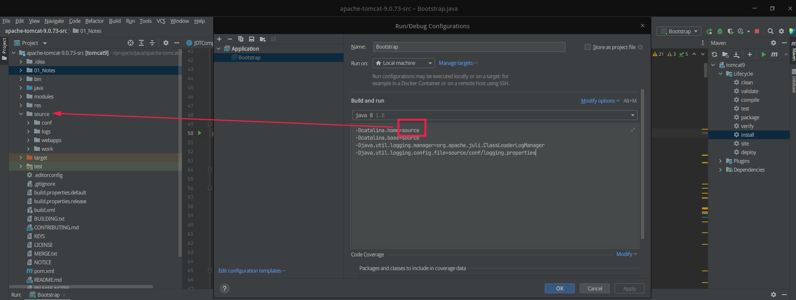

# Tomcat9源码环境搭建

1. 下载源码

   https://tomcat.apache.org/，见页面左边的Download。

2. 在源码文件夹内，创建一个source目录。

3. 将源码文件夹内的conf、webapps目录**剪切**到source目录下。

4. 在源码文件夹内新建一个pom.xml文件，准备以maven工程的形式运行源码：

   ```xml
   <?xml version="1.0" encoding="UTF-8"?>
   <project xmlns="http://maven.apache.org/POM/4.0.0"
            xmlns:xsi="http://www.w3.org/2001/XMLSchema-instance"
            xsi:schemaLocation="http://maven.apache.org/POM/4.0.0 http://maven.apache.org/xsd/maven-4.0.0.xsd">
       <modelVersion>4.0.0</modelVersion>
       <groupId>org.apache.tomcat</groupId>
       <artifactId>tomcat9</artifactId>
       <name>tomcat9</name>
       <version>9.0</version>
       <build>
           <finalName>tomcat9</finalName>
           <sourceDirectory>java</sourceDirectory>
           <!--<testSourceDirectory>test</testSourceDirectory>  test 下的有些文件报错，因此将test文件夹去掉了-->
           <resources>
               <resource>
                   <directory>java</directory>
               </resource>
           </resources>
           <testResources>
               <testResource>
                   <directory>test</directory>
               </testResource>
           </testResources>
           <plugins>
               <plugin>
                   <groupId>org.apache.maven.plugins</groupId>
                   <artifactId>maven-compiler-plugin</artifactId>
                   <version>3.6.0</version>
                   <configuration>
                       <encoding>UTF-8</encoding>
                       <source>1.8</source>
                       <target>1.8</target>
                   </configuration>
               </plugin>
               <plugin>
                   <groupId>org.apache.maven.plugins</groupId>
                   <artifactId>maven-jar-plugin</artifactId>
                   <version>3.0.2</version>
               </plugin>
           </plugins>
       </build>
        <dependencies>
           <dependency>
               <groupId>org.apache.ant</groupId>
               <artifactId>ant</artifactId>
               <version>1.9.5</version>
           </dependency>
           <dependency>
               <groupId>org.apache.ant</groupId>
               <artifactId>ant-apache-log4j</artifactId>
               <version>1.9.5</version>
           </dependency>
           <dependency>
               <groupId>org.apache.ant</groupId>
               <artifactId>ant-commons-logging</artifactId>
               <version>1.9.5</version>
           </dependency>
           <dependency>
               <groupId>javax.xml.rpc</groupId>
               <artifactId>javax.xml.rpc-api</artifactId>
               <version>1.1</version>
           </dependency>
           <dependency>
               <groupId>wsdl4j</groupId>
               <artifactId>wsdl4j</artifactId>
               <version>1.6.2</version>
           </dependency>
           <dependency>
               <groupId>org.eclipse.jdt.core.compiler</groupId>
               <artifactId>ecj</artifactId>
               <version>4.6.1</version>
           </dependency>
          <dependency>
            <groupId>biz.aQute.bnd</groupId>
            <artifactId>biz.aQute.bndlib</artifactId>
            <version>5.2.0</version>
            <scope>provided</scope>
          </dependency>
       </dependencies>
   </project>
   ```

5. 工程导入IDEA，运行maven工程的clean、install流程。

6. 将org.apache.jasper.compiler.JDTCompiler内标红的代码注释。

7. Tomcat的启动类是org.apache.catalina.startup.Bootstrap，在IDEA给这个启动类配置一些JVM参数：

   ```
   -Dcatalina.home=source
   -Dcatalina.base=source
   -Djava.util.logging.manager=org.apache.juli.ClassLoaderLogManager
   -Djava.util.logging.config.file=source/conf/logging.properties
   ```

   

8.启动Bootstrap，可以发现没问题（乱码先忽略），访问8080端口也是通的：


```bash
kjg@kjg-PC:~$ curl http://localhost:8080
<!doctype html><html lang="zh"><head><title>HTTP #¶æ 500 - åé¨æ #¡å¨é误</title><style type="text/css">body {font-family:Tahoma,Arial,sans-serif;} h1, h2, h3, b {color:white;background-color:#525D76;} h1 {font-size:22px;} h2 {font-size:16px;} h3 {font-size:14px;} p {font-size:12px;} a {color:black;} .line {height:1px;background-color:#525D76;border:none;}</style></head><body><h1>HTTP #¶æ 500 - åé¨æ #¡å¨é误</h1><hr class="line" /><p><b>ç±»å</b> å¼å¸¸ #¥ #</p><p><b>æ¶æ¯</b> org.apache.jasper.JasperException: æ æ³ä¸ºJSPç¼è¯ç±»</p><p><b>æè¿°</b> æ #¡å¨éå°ä¸ä¸ªæå¤çæåµï¼é»æ¢å®å®æ请æ±ã</p><p><b>ä¾å¤æåµ</b></p><pre>org.apache.jasper.JasperException: org.apache.jasper.JasperException: æ æ³ä¸ºJSPç¼è¯ç±»
```

9. 这个报错的原因是Tomcat有一个JSP的解析引擎jasper没有被初始化，因此在org.apache.catalina.startup.ContextConfig#configureStart方法里添加一行代码将jasper初始化（加在webConfig()方法下面）：

   ```java
   protected synchronized void configureStart() {
       // Called from StandardContext.start()

       if (log.isDebugEnabled()) {
           log.debug(sm.getString("contextConfig.start"));
       }

       if (log.isDebugEnabled()) {
           log.debug(sm.getString("contextConfig.xmlSettings",
                   context.getName(),
                   Boolean.valueOf(context.getXmlValidation()),
                   Boolean.valueOf(context.getXmlNamespaceAware())));
       }

       webConfig();

       context.addServletContainerInitializer(new JasperInitializer(),null);

       // ignore
   }
   ```

10. 重新启动，Tomcat正常对外访问：

    