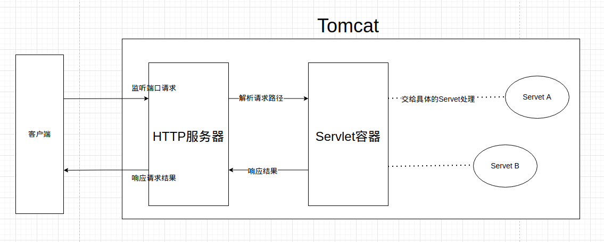
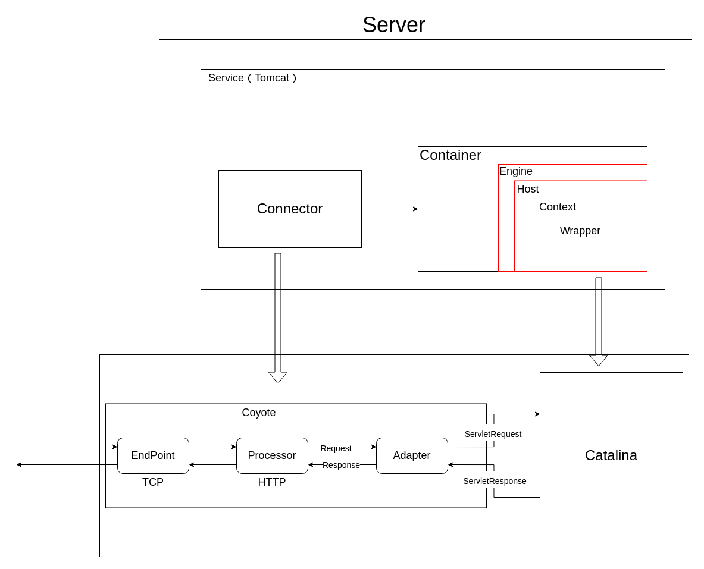
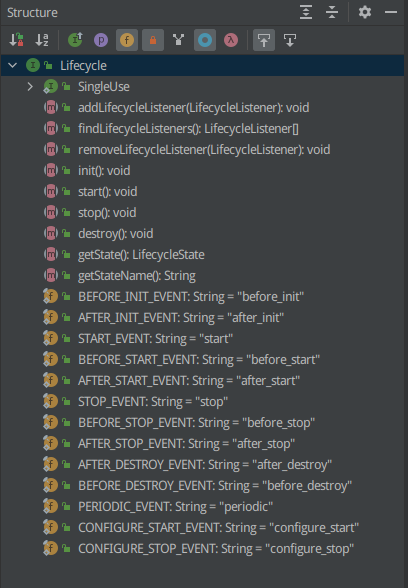

# Tomcat的功能

Tomcat无论采用什么架构，本质是为了实现功能而设计的，所以有必要认清楚Tomcat的功能本质：

1. HTTP服务器

   通过Socket（TCP/IP）监听HTTP请求，解析HTTP报文，与客户端进行交互。

2. Servlet容器

   包含自带的Servlet与开发人员自定义的Servlet，通过Servlet处理具体的业务逻辑。

# Tomcat的整体架构

1个Service代表1个Tomcat实例，1个Tomcat里面可以包含多个Connector，1个Connector对应1个Container。

Connector（抽象为Coyote）完成HTTP服务器功能，Container（抽象为Catalina）组件完成Servlet容器功能。不同的Connector可以监听不同的端口，也就是说一个Tomcat可以支持跑多个代码（这也是为什么早期需要Tomcat实现自定义类加载器破坏双亲委派机制的原因之一）。对于现阶段来说，基本都是一个Tomcat跑一个Connector了，我没有经历过跑多个代码的时期。

而Coyote又能拆分出EndPoint、Processor、Adapter这3个组件。EndPoint和Processor可以抽象理解为ProtocolHandler，用来处理外部请求并解析。EndPoint通过NIO模型，进行Socket通信，基于TCP/IP协议解析外部的TCP请求。在EndPoint层面，可以通过APR实现自定义IO模型处理，这部分属于自定义调优层面，这里不展开讲。Processor基于HTTP协议，将EndPoint的TCP请求解析为HTTP请求，将HTTP请求包装成Request、Response这两个对象，交给Adapater进行处理。

Adapter将Request、Repsonse再进行封装，形成ServletRequest、ServletResponse对象，也就是Servlet方法上的那2个参数，交给Servlet容器处理，得到响应，最终逐层返回给客户端。

# LifeCycle

上面介绍了Tomcat各个组件，Tomcat在启动的时候需要对这些组件进行初始化操作，既然是初始化就肯定伴随着组件的生命周期。Tomcat里面这么多组件，为了统一规范它们的生命周期，Tomcat将生命周期抽象为org.apache.catalina.Lifecycle这个接口：

这个接口定义了组件各个生命周期调用的方法，其中就包含了上面说的Connector、Container以及Container下的Engine、Host、Context、Wrapper。